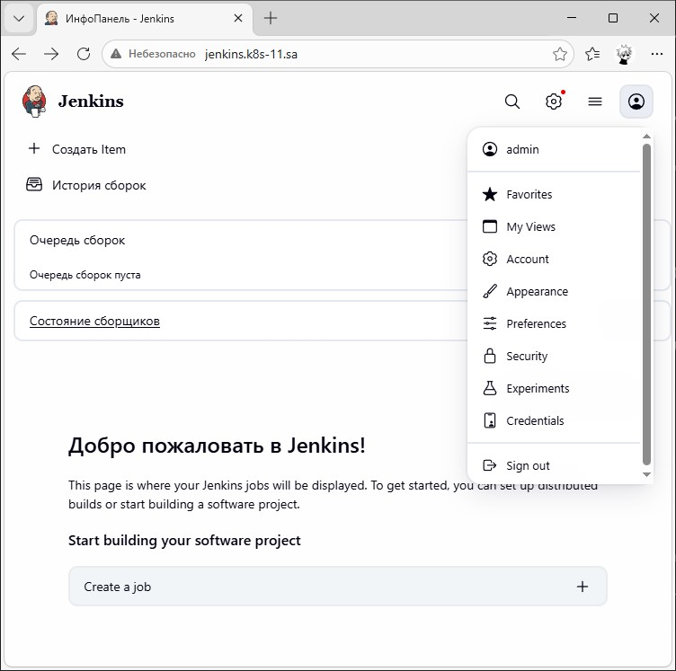

# 14. Kubernetes application deployment

## 1. Transform Jenkins deployment to Helm

```bash
  385  cd ~/../user/14.K8s
  386  mkdir HelmJenkins
  387  cd HelmJenkins/
  388  helm create jenkins
  # configured files for helm using jenkins.yaml from workshop lesson 14
  404  helm install jenkins-test . --dry-run --debug -n ci-cd --kube-context k8s
  # testing and fixing variables in manifests for helm install
  425  helm install jenkins-test . -n ci-cd --create-namespace --kube-context k8s
  426  kubectl get pods -n ci-cd
```

